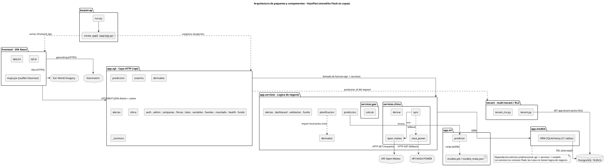
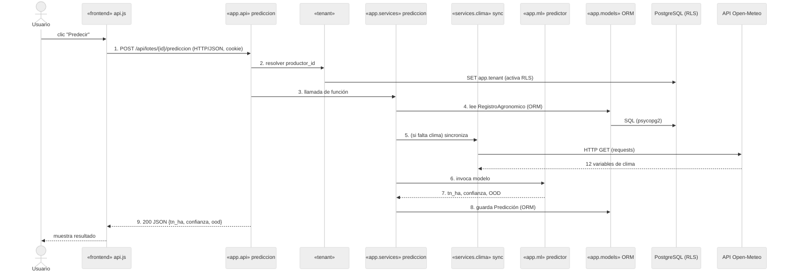

# Diagramas de Arquitectura (paquetes y componentes) — HassPlan

> Diagramas técnicos UML para el informe (punto 1.3, Arquitectura del sistema). Monocromáticos,
> a nivel de **paquetes/componentes**, con las **líneas etiquetadas** por mecanismo de comunicación.
> Regla de capas: **api → services → models** (dependencia estricta unidireccional).
>
> - **PlantUML** = estándar UML para la tesis. Renderiza en <https://www.plantuml.com/plantuml> o
>   con la extensión PlantUML de VS Code. `skinparam monochrome true` fuerza blanco y negro.
> - **Mermaid** = render inmediato en <https://mermaid.live>. `theme: neutral` = escala de grises.
>
> Convención de líneas: **flecha continua** = llamada/dependencia en proceso · **flecha discontinua**
> = registro/arranque o *fallback*.

---

## 1. Arquitectura — PlantUML (recomendado para el informe)



---

## 2. Arquitectura — Mermaid (render inmediato)

```mermaid
%%{init: {'theme':'neutral'}}%%
flowchart TB
    subgraph FE["frontend — SPA React"]
        apijs[api.js]
        appjsx[app.jsx]
        mapa["mapa.jsx (Leaflet+Geoman)"]
    end
    subgraph BOOT["bootstrap"]
        run[run.py]
        app["create_app()"]
    end
    subgraph API["app.api — Capa HTTP /api"]
        apip[prediccion]
        apic[cosecha]
        apid[derivados]
        apia[alertas]
        common[_common]
        apietc["auth · clima · variables · fincas · lotes · ..."]
    end
    subgraph SVC["app.services — Lógica de negocio"]
        svcp[prediccion]
        svcplan[planificacion]
        svcder[derivados]
        svcetc["alertas · dashboard · validacion"]
        subgraph CLI["services.clima"]
            sync[sync]
            omc[open_meteo]
            nasac[nasa_power]
        end
        geo["services.geo · calculo"]
    end
    subgraph ML["app.ml"]
        pred[predictor]
        pkl[(modelo.pkl)]
    end
    subgraph MOD["app.models"]
        orm["ORM SQLAlchemy (21 tablas)"]
    end
    subgraph TEN["tenant — RLS"]
        tpy[tenant.py]
    end

    PG[(PostgreSQL 18 · RLS)]
    OM{{API Open-Meteo}}
    NASA{{API NASA POWER}}
    ESRI{{Esri World Imagery}}
    NOM{{Nominatim}}

    FE -->|HTTP/JSON fetch + cookie| API
    FE -->|tiles| ESRI
    FE -->|geocoding| NOM
    run --> app
    app -.->|registra| API
    app -.->|sirve| FE
    API -->|llamada función · api→services| SVC
    API -.->|productor_id| TEN
    svcp -->|invoca| pred
    pred -.->|joblib| pkl
    SVC -->|ORM| MOD
    sync --> omc -->|HTTP GET requests| OM
    sync -.-> nasac -.->|fallback| NASA
    svcplan -.->|import local · evita ciclo| svcder
    orm -->|SQL psycopg2| PG
    tpy -->|SET app.tenant| PG
```



---

## 3. Flujo entre componentes — PlantUML (secuencia)

Caso: **"Predecir el rendimiento de un lote"** (recorre todos los paquetes).

```plantuml
@startuml
skinparam monochrome true
skinparam shadowing false
title Flujo de comunicacion - "Predecir rendimiento de un lote"

actor Usuario as U
participant "<<frontend>>\napi.js" as FE
participant "<<app.api>>\nprediccion" as API
participant "<<tenant>>\ntenant.py" as TEN
participant "<<app.services>>\nprediccion" as SVC
participant "<<services.clima>>\nsync" as CLI
participant "<<app.ml>>\npredictor" as ML
participant "<<app.models>>\nORM" as MOD
database "PostgreSQL 18\n(RLS)" as PG
cloud "API Open-Meteo" as OM

U -> FE : clic "Predecir"
FE -> API : 1. POST /api/lotes/{id}/prediccion\n(HTTP/JSON, cookie)
API -> TEN : 2. resolver productor_id
TEN -> PG : SET app.tenant (activa RLS)
API -> SVC : 3. llamada de funcion
SVC -> MOD : 4. lee RegistroAgronomico (ORM)
MOD -> PG : SQL (psycopg2)
SVC -> CLI : 5. (si falta clima) sincroniza
CLI -> OM : HTTP GET (requests)
OM --> CLI : 12 variables de clima
SVC -> ML : 6. invoca modelo
ML --> SVC : 7. tn_ha, confianza, OOD
SVC -> MOD : 8. guarda Prediccion (ORM)
MOD -> PG : SQL
API --> FE : 9. 200 JSON {tn_ha, confianza, ood}
FE --> U : muestra resultado
@enduml
```

---

## 4. Flujo entre componentes — Mermaid (secuencia)


