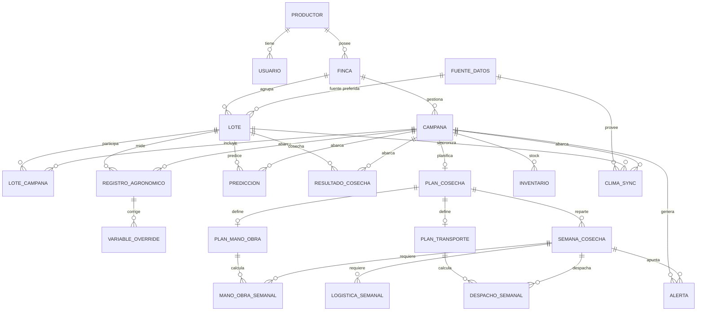

# Modelo Lógico y Diccionario de Datos — HassPlan

> **Punto 1.2 — Infraestructura de información.** Este documento reemplaza al diagrama
> entidad-relación completo (demasiado grande para el informe) por su forma tabular:
> **(1)** listado de entidades, **(2)** cardinalidad de las relaciones y **(3)** diccionario
> de datos por tabla. La seguridad de datos (RLS) se describe en §4.
>
> Fuente de verdad: `app/models.py` (SQLAlchemy) y el esquema físico en `sql/*.sql`.
> Base de datos: **PostgreSQL 18**. Total: **21 tablas**.

## Convenciones

- **PK** = clave primaria · **FK** = clave foránea · **UK** = clave única (UNIQUE).
- **(T)** junto al nombre de la tabla = tabla **multi-tenant**: incluye la columna
  `productor_id INTEGER NOT NULL · FK → productor · ON DELETE CASCADE`, que aísla los datos
  de cada cliente (ver §4, RLS). Para no repetirla 19 veces, se documenta **una sola vez aquí**
  y se omite en cada diccionario.
- Tipos: se indica el tipo **lógico**; entre paréntesis el tipo físico en PostgreSQL cuando
  difiere del mapeo directo del ORM.

---

## 1. Listado de entidades (tablas)

| # | Tabla | Módulo / Área | Descripción |
|---|-------|---------------|-------------|
| 1 | `productor` | Multi-tenant | Cliente del SaaS. Raíz del aislamiento de datos (tenant). |
| 2 | `usuario` | Multi-tenant | Usuario del sistema. `productor_id` NULL = SUPERADMIN. |
| 3 | `finca` (T) | Registro | Chacra/propiedad del agricultor. Agrupa lotes. |
| 4 | `campana` (T) | Registro | Campaña agrícola de una finca (ej. 2024-2025). |
| 5 | `lote` (T) | Registro | Parcela dentro de la finca. **Unidad de predicción del modelo ML.** |
| 6 | `lote_campana` (T) | Registro | Tabla puente: qué lotes participan en cada campaña. |
| 7 | `registro_agronomico` (T) | Entrada ML | Las 15 variables de entrada al modelo (por lote y campaña). |
| 8 | `variable_override` (T) | Entrada ML | Corrección manual de un valor climático que vino de la API. |
| 9 | `prediccion` (T) | Salida ML | Rendimiento estimado (Tn/Ha) que genera el modelo. |
| 10 | `resultado_cosecha` (T) | Resultado real | Rendimiento real tras cosechar; se compara con la predicción. |
| 11 | `plan_cosecha` (T) | Planificación | Reparte la producción estimada en semanas de cosecha. |
| 12 | `semana_cosecha` (T) | Planificación | Una semana del plan; unidad que consumen M6/M7/M8. |
| 13 | `plan_mano_obra` (T) | Planificación (M6) | Parámetros para calcular personal requerido. |
| 14 | `mano_obra_semanal` (T) | Planificación (M6) | Jornales/cuadrillas requeridos por semana. |
| 15 | `inventario` (T) | Planificación (M7) | Stock de materiales (jabas, pallets, EPP…). |
| 16 | `logistica_semanal` (T) | Planificación (M7) | Materiales requeridos por semana. |
| 17 | `plan_transporte` (T) | Planificación (M8) | Parámetros para calcular camiones, viajes y costos. |
| 18 | `despacho_semanal` (T) | Planificación (M8) | Camiones/viajes/costo por semana. |
| 19 | `alerta` (T) | Monitoreo | Notificación automática por déficit de un módulo. |
| 20 | `fuente_datos` | Clima (M10) | Catálogo de proveedores meteorológicos. **Compartido (sin tenant).** |
| 21 | `clima_sync` (T) | Clima (M10) | Log de cada sincronización climática de un lote/campaña. |

---

## 2. Cardinalidad de las relaciones

Notación: **1:N** (uno a muchos), **1:1** (uno a uno / a lo sumo uno), **N:M** (muchos a muchos,
resuelto con tabla puente). "0..1" indica participación opcional.

| Entidad origen | Card. | Entidad destino | Descripción de la relación |
|----------------|:-----:|-----------------|----------------------------|
| `productor` | 1:N | `usuario` | Un productor tiene varios usuarios. |
| `productor` | 1:N | `finca` | Un productor posee una o varias fincas (normalmente una). |
| `productor` | 1:N | *(todas las tablas T)* | Aislamiento multi-tenant: cada fila operativa pertenece a un productor. |
| `finca` | 1:N | `campana` | Una finca gestiona varias campañas. |
| `finca` | 1:N | `lote` | Una finca agrupa varios lotes. |
| `lote` — `campana` | **N:M** | `lote_campana` | Un lote participa en varias campañas y una campaña incluye varios lotes (puente, con UNIQUE(lote_id, campana_id)). |
| `lote` | 1:N | `registro_agronomico` | Un lote tiene un registro de variables por campaña. |
| `campana` | 1:N | `registro_agronomico` | Una campaña abarca los registros de sus lotes. |
| `registro_agronomico` | 1:N | `variable_override` | Un registro puede tener varias celdas corregidas a mano. |
| `lote` | 1:N | `prediccion` | Un lote acumula predicciones (una por campaña). |
| `campana` | 1:N | `prediccion` | Una campaña abarca las predicciones de sus lotes. |
| `lote` | 1:N | `resultado_cosecha` | Un lote acumula resultados reales (uno por campaña). |
| `campana` | 1:N | `resultado_cosecha` | Una campaña abarca los resultados de sus lotes. |
| `campana` | **1:0..1** | `plan_cosecha` | Una campaña tiene a lo sumo un plan de cosecha. |
| `plan_cosecha` | 1:N | `semana_cosecha` | Un plan se reparte en varias semanas. |
| `plan_cosecha` | **1:0..1** | `plan_mano_obra` | Un plan define a lo sumo un plan de mano de obra. |
| `plan_cosecha` | **1:0..1** | `plan_transporte` | Un plan define a lo sumo un plan de transporte. |
| `plan_mano_obra` | 1:N | `mano_obra_semanal` | El plan de M.O. calcula un requerimiento por semana. |
| `semana_cosecha` | 1:N | `mano_obra_semanal` | Cada semana tiene su requerimiento de personal. |
| `semana_cosecha` | 1:N | `logistica_semanal` | Cada semana tiene requerimientos de materiales. |
| `plan_transporte` | 1:N | `despacho_semanal` | El plan de transporte calcula un despacho por semana. |
| `semana_cosecha` | 1:N | `despacho_semanal` | Cada semana tiene su despacho. |
| `campana` | 1:N | `inventario` | Una campaña maneja varios materiales en stock. |
| `campana` | 1:N | `alerta` | Una campaña genera varias alertas. |
| `semana_cosecha` | 1:0..N | `alerta` | Una alerta puede apuntar a una semana (opcional). |
| `fuente_datos` | 1:N | `lote` | Una fuente puede ser la preferida de varios lotes. |
| `fuente_datos` | 1:N | `clima_sync` | Una fuente provee muchas sincronizaciones. |
| `lote` | 1:N | `clima_sync` | Un lote acumula varias sincronizaciones climáticas. |
| `campana` | 1:N | `clima_sync` | Una campaña abarca las sincronizaciones de sus lotes. |

---

## 3. Diccionario de datos

### 3.1 `productor`
| Columna | Tipo | Restricción | Descripción |
|---------|------|-------------|-------------|
| id | INTEGER | PK | Identificador del productor (tenant). |
| nombre_comercial | VARCHAR(100) | NOT NULL | Nombre comercial del cliente. |
| ruc_dni | VARCHAR(20) | UK | RUC o DNI (único). |
| correo_contacto | VARCHAR(100) | | Correo de contacto. |
| telefono | VARCHAR(20) | | Teléfono de contacto. |
| fecha_registro | TIMESTAMP | default now | Alta del cliente. |
| activo | BOOLEAN | default TRUE | Si el cliente está activo. |

### 3.2 `usuario`
| Columna | Tipo | Restricción | Descripción |
|---------|------|-------------|-------------|
| id | INTEGER | PK | Identificador del usuario. |
| productor_id | INTEGER | FK → productor, NULL | Tenant del usuario. **NULL = SUPERADMIN.** |
| nombre_usuario | VARCHAR(50) | NOT NULL, UK | Nombre de acceso. |
| correo | VARCHAR(100) | NOT NULL, UK | Correo (login). |
| contrasena_hash | VARCHAR(255) | NOT NULL | Hash de la contraseña. |
| tipo_usuario | VARCHAR(30) | NOT NULL | `SUPERADMIN` \| `CLIENTE_ADMIN` \| `CLIENTE_CAMPO`. |
| activo | BOOLEAN | default TRUE | Si el usuario está habilitado. |

### 3.3 `finca` (T)
| Columna | Tipo | Restricción | Descripción |
|---------|------|-------------|-------------|
| id | INTEGER | PK | Identificador de la finca. |
| nombre | VARCHAR(50) | NOT NULL | Nombre de la chacra (ej. "Chacra La Joya"). |
| distrito | VARCHAR(120) | | Ubicación textual (ej. "La Joya, Arequipa"). |
| area_total_ha | DOUBLE PRECISION | | Superficie total (suma de lotes). |
| geometria | TEXT | | Contorno de la finca en GeoJSON. |
| centro_lat | DOUBLE PRECISION | | Latitud del centroide (centra el mapa). |
| centro_lon | DOUBLE PRECISION | | Longitud del centroide. |

### 3.4 `campana` (T)
| Columna | Tipo | Restricción | Descripción |
|---------|------|-------------|-------------|
| id | INTEGER | PK | Identificador de la campaña. |
| finca_id | INTEGER | FK → finca, NOT NULL | Finca a la que pertenece. |
| nombre | VARCHAR(50) | NOT NULL | Nombre de la campaña (ej. "2024-2025"). |
| fecha_inicio | DATE | NOT NULL | Inicio de la campaña. |
| fecha_fin | DATE | NOT NULL | Fin de la campaña. |
| estado | VARCHAR(20) | default 'borrador' | `borrador` \| `activa` \| `cerrada`. |

### 3.5 `lote` (T)
| Columna | Tipo | Restricción | Descripción |
|---------|------|-------------|-------------|
| id | INTEGER | PK | Identificador del lote. |
| finca_id | INTEGER | FK → finca, NOT NULL | Finca a la que pertenece. |
| nombre | VARCHAR(50) | NOT NULL | Nombre del lote (ej. "Lote 1"). |
| area_ha | DOUBLE PRECISION | NOT NULL | Área en hectáreas (del polígono o manual). |
| variedad | VARCHAR(50) | default 'Hass' | Variedad plantada. |
| ano_plantacion | INTEGER | | Año de plantación (deriva la edad del cultivo). |
| densidad_plantas_ha | DOUBLE PRECISION | | Marco de plantación (plantas/Ha). |
| en_produccion | BOOLEAN | default TRUE | Estado productivo físico del lote. |
| geometria | TEXT | | Geometría del lote (GeoJSON Polygon o Point). |
| latitud | DOUBLE PRECISION | | Latitud del centroide (alimenta el clima). |
| longitud | DOUBLE PRECISION | | Longitud del centroide. |
| fuente_preferida_id | INTEGER | FK → fuente_datos | Fuente meteorológica preferida. |

### 3.6 `lote_campana` (T)
| Columna | Tipo | Restricción | Descripción |
|---------|------|-------------|-------------|
| id | INTEGER | PK | Identificador de la participación. |
| lote_id | INTEGER | FK → lote, NOT NULL | Lote que participa. |
| campana_id | INTEGER | FK → campana, NOT NULL | Campaña en la que participa. |
| en_produccion | BOOLEAN | default TRUE | Estado productivo del lote **en esa campaña**. |
| — | — | UNIQUE(lote_id, campana_id) | Un lote no se asocia dos veces a la misma campaña. |

### 3.7 `registro_agronomico` (T) — entrada al modelo (15 features)
| Columna | Tipo | Restricción | Descripción |
|---------|------|-------------|-------------|
| id | INTEGER | PK | Identificador del registro. |
| lote_id | INTEGER | FK → lote, NOT NULL | Lote medido. |
| campana_id | INTEGER | FK → campana, NOT NULL | Campaña del registro. |
| edad_campo | INTEGER | | Años desde plantación (feature, imp. 0.217). |
| edad_prod | INTEGER | | Años en producción (feature, imp. 0.209). |
| riego_m3ha | DOUBLE PRECISION | | Volumen de riego M³/Ha (feature, imp. 0.163). |
| hfrio_19 | DOUBLE PRECISION | | Horas frío < 19 °C. |
| hfrio_14_19 | DOUBLE PRECISION | | Horas frío 14–19 °C. |
| hfrio_14 | DOUBLE PRECISION | | Horas frío < 14 °C. |
| hfrio_15 | DOUBLE PRECISION | | Horas frío < 15 °C. |
| hac_20_25 | DOUBLE PRECISION | | Horas de calor acumulado 20–25 °C. |
| hac_25 | DOUBLE PRECISION | | Horas de calor acumulado > 25 °C. |
| humedad | DOUBLE PRECISION | | Humedad promedio (%). |
| eto | DOUBLE PRECISION | | Evapotranspiración (mm). |
| t_min | DOUBLE PRECISION | | Temperatura mínima (°C). |
| t_max | DOUBLE PRECISION | | Temperatura máxima (°C). |
| t_prom | DOUBLE PRECISION | | Temperatura promedio (°C). |
| lluvia | DOUBLE PRECISION | | Precipitación (mm). |

> Las 3 primeras son **manuales**; las 12 climáticas las calcula el motor de clima desde la API.

### 3.8 `variable_override` (T)
| Columna | Tipo | Restricción | Descripción |
|---------|------|-------------|-------------|
| id | INTEGER | PK | Identificador del override. |
| registro_id | INTEGER | FK → registro_agronomico, NOT NULL | Registro corregido. |
| var_key | VARCHAR(30) | NOT NULL | Nombre de la variable corregida (ej. "hfrio_19"). |
| valor | DOUBLE PRECISION | | Valor manual que sustituye al de la API. |
| motivo | VARCHAR(255) | | Justificación del cambio. |
| fecha | TIMESTAMP | default now | Fecha de la corrección. |

### 3.9 `prediccion` (T) — salida del modelo
| Columna | Tipo | Restricción | Descripción |
|---------|------|-------------|-------------|
| id | INTEGER | PK | Identificador de la predicción. |
| lote_id | INTEGER | FK → lote, NOT NULL | Lote predicho. |
| campana_id | INTEGER | FK → campana, NOT NULL | Campaña de la predicción. |
| tn_ha_predicho | DOUBLE PRECISION | NOT NULL | Rendimiento estimado por hectárea. |
| tn_total_predicho | DOUBLE PRECISION | | tn_ha_predicho × área del lote. |
| nivel_confianza | DOUBLE PRECISION | | Dispersión entre árboles del RF (%). |
| intervalo_p10 | DOUBLE PRECISION | | Rendimiento plausible bajo (percentil 10). |
| intervalo_p90 | DOUBLE PRECISION | | Rendimiento plausible alto (percentil 90). |
| fecha | TIMESTAMP | default now | Fecha de cálculo. |

### 3.10 `resultado_cosecha` (T) — dato real
| Columna | Tipo | Restricción | Descripción |
|---------|------|-------------|-------------|
| id | INTEGER | PK | Identificador del resultado. |
| lote_id | INTEGER | FK → lote, NOT NULL | Lote cosechado. |
| campana_id | INTEGER | FK → campana, NOT NULL | Campaña del resultado. |
| tn_ha_real | DOUBLE PRECISION | NOT NULL | Rendimiento REAL (Tn/Ha) — se compara con la predicción. |
| frutos_arbol | DOUBLE PRECISION | | Frutos por árbol (**solo post-cosecha; no entra al modelo**). |
| peso_fruto | DOUBLE PRECISION | | Peso del fruto en g (**solo post-cosecha; no entra al modelo**). |
| fecha_cierre | DATE | | Fecha de cierre de la cosecha. |

### 3.11 `plan_cosecha` (T)
| Columna | Tipo | Restricción | Descripción |
|---------|------|-------------|-------------|
| id | INTEGER | PK | Identificador del plan. |
| campana_id | INTEGER | FK → campana, NOT NULL | Campaña planificada. |
| fecha_inicio | DATE | NOT NULL | Inicio de la cosecha. |
| semanas_total | INTEGER | NOT NULL | Número de semanas del plan. |
| tn_total | DOUBLE PRECISION | | Producción estimada total (Σ predicciones). |
| curva | VARCHAR(20) | NOT NULL, default 'campana' | Forma del reparto semanal. |

### 3.12 `semana_cosecha` (T)
| Columna | Tipo | Restricción | Descripción |
|---------|------|-------------|-------------|
| id | INTEGER | PK | Identificador de la semana. |
| plan_id | INTEGER | FK → plan_cosecha, NOT NULL | Plan al que pertenece. |
| numero_semana | INTEGER | NOT NULL | Número de semana dentro del plan. |
| fecha_inicio | DATE | | Inicio de la semana. |
| fecha_fin | DATE | | Fin de la semana. |
| tn_planificada | DOUBLE PRECISION | NOT NULL | Toneladas planificadas para la semana. |
| porcentaje | DOUBLE PRECISION | | % del total de la campaña. |
| tn_real | DOUBLE PRECISION | | Cosecha real registrada (F7); NULL = aún sin registrar. |

### 3.13 `plan_mano_obra` (T)
| Columna | Tipo | Restricción | Descripción |
|---------|------|-------------|-------------|
| id | INTEGER | PK | Identificador del plan de mano de obra. |
| plan_cosecha_id | INTEGER | FK → plan_cosecha, NOT NULL | Plan de cosecha asociado. |
| rendimiento_jornal | DOUBLE PRECISION | NOT NULL | Tn que cosecha 1 jornal/día. |
| tam_cuadrilla | INTEGER | NOT NULL | Trabajadores por cuadrilla. |
| cuadrillas_disponibles | INTEGER | default 0 | Cuadrillas disponibles. |
| dias_cosecha_semana | INTEGER | default 6 | Días laborables por semana. |

### 3.14 `mano_obra_semanal` (T)
| Columna | Tipo | Restricción | Descripción |
|---------|------|-------------|-------------|
| id | INTEGER | PK | Identificador. |
| plan_id | INTEGER | FK → plan_mano_obra, NOT NULL | Plan de M.O. asociado. |
| semana_id | INTEGER | FK → semana_cosecha, NOT NULL | Semana calculada. |
| jornales_req | DOUBLE PRECISION | | Jornales requeridos. |
| cuadrillas_req | INTEGER | | Cuadrillas requeridas. |
| deficit | INTEGER | default 0 | Cuadrillas faltantes (>0 = alerta). |

### 3.15 `inventario` (T)
| Columna | Tipo | Restricción | Descripción |
|---------|------|-------------|-------------|
| id | INTEGER | PK | Identificador. |
| campana_id | INTEGER | FK → campana, NOT NULL | Campaña del inventario. |
| material | VARCHAR(50) | NOT NULL | `jaba` \| `pallet` \| `herramienta` \| `epp`. |
| cantidad_disponible | DOUBLE PRECISION | default 0 | Stock disponible. |
| unidad | VARCHAR(20) | | Unidad de medida. |
| consumo_por_tn | DOUBLE PRECISION | | Unidades gastadas por tonelada. |

### 3.16 `logistica_semanal` (T)
| Columna | Tipo | Restricción | Descripción |
|---------|------|-------------|-------------|
| id | INTEGER | PK | Identificador. |
| semana_id | INTEGER | FK → semana_cosecha, NOT NULL | Semana calculada. |
| material | VARCHAR(50) | NOT NULL | Material requerido. |
| cantidad_requerida | DOUBLE PRECISION | | Cantidad requerida. |
| deficit | DOUBLE PRECISION | default 0 | Requerido − disponible (>0 = alerta). |

### 3.17 `plan_transporte` (T)
| Columna | Tipo | Restricción | Descripción |
|---------|------|-------------|-------------|
| id | INTEGER | PK | Identificador. |
| plan_cosecha_id | INTEGER | FK → plan_cosecha, NOT NULL | Plan de cosecha asociado. |
| cap_camion_tn | DOUBLE PRECISION | NOT NULL | Capacidad por camión (Tn). |
| costo_por_viaje | DOUBLE PRECISION (NUMERIC(12,2)) | NOT NULL | Costo por viaje. |
| camiones_disponibles | INTEGER | default 0 | Flota disponible. |
| viajes_por_camion_semana | INTEGER | default 6 | Viajes por camión/semana. |

### 3.18 `despacho_semanal` (T)
| Columna | Tipo | Restricción | Descripción |
|---------|------|-------------|-------------|
| id | INTEGER | PK | Identificador. |
| plan_id | INTEGER | FK → plan_transporte, NOT NULL | Plan de transporte asociado. |
| semana_id | INTEGER | FK → semana_cosecha, NOT NULL | Semana despachada. |
| tn_despachadas | DOUBLE PRECISION | | Toneladas despachadas. |
| camiones | INTEGER | | Camiones requeridos. |
| viajes | INTEGER | | Viajes requeridos. |
| costo | DOUBLE PRECISION (NUMERIC(12,2)) | | Costo de la semana. |
| deficit | INTEGER | default 0 | Camiones faltantes (>0 = alerta). |

### 3.19 `alerta` (T)
| Columna | Tipo | Restricción | Descripción |
|---------|------|-------------|-------------|
| id | INTEGER | PK | Identificador. |
| campana_id | INTEGER | FK → campana, NOT NULL | Campaña de la alerta. |
| semana_id | INTEGER | FK → semana_cosecha, NULL | Semana del déficit (opcional). |
| tipo | VARCHAR(50) | | `deficit_personal` \| `deficit_material` \| `deficit_transporte`. |
| mensaje | VARCHAR(255) | NOT NULL | Texto de la alerta. |
| modulo_origen | VARCHAR(50) | | `cosecha` \| `mano_obra` \| `logistica` \| `transporte`. |
| severidad | VARCHAR(20) | default 'media' | `baja` \| `media` \| `alta`. |
| fecha_creacion | TIMESTAMP | default now | Fecha de creación. |
| estado | VARCHAR(20) | default 'activa' | `activa` \| `resuelta`. |

### 3.20 `fuente_datos` — catálogo compartido (sin tenant)
| Columna | Tipo | Restricción | Descripción |
|---------|------|-------------|-------------|
| id | INTEGER | PK | Identificador de la fuente. |
| nombre | VARCHAR(60) | NOT NULL | Nombre (ej. "NASA POWER"). |
| tipo | VARCHAR(30) | NOT NULL | `open_meteo` \| `nasa_power` \| `agera5` \| `davis` \| `manual`. |
| endpoint | VARCHAR(200) | | URL base de la API. |
| resolucion | VARCHAR(60) | | Resolución (ej. "horario · 0.1°"). |
| activa | BOOLEAN | default TRUE | Si la fuente está activa. |

### 3.21 `clima_sync` (T)
| Columna | Tipo | Restricción | Descripción |
|---------|------|-------------|-------------|
| id | INTEGER | PK | Identificador de la sincronización. |
| lote_id | INTEGER | FK → lote, NOT NULL | Lote sincronizado. |
| campana_id | INTEGER | FK → campana, NOT NULL | Campaña de la sincronización. |
| fuente_id | INTEGER | FK → fuente_datos | Fuente utilizada. |
| ventana_inicio | DATE | | Inicio de la ventana consultada. |
| ventana_fin | DATE | | Fin de la ventana consultada. |
| fetched_at | TIMESTAMP | default now | Momento de la sincronización. |
| status | VARCHAR(20) | default 'ok' | `ok` \| `error` \| `stale`. |
| mensaje | TEXT | | Detalle (errores, fallback, etc.). |

---

## 4. Seguridad de datos — Row Level Security (RLS)

El aislamiento entre clientes (tenants) **no** depende del código de la aplicación, sino que lo
**fuerza el motor PostgreSQL**:

- **Columna de aislamiento:** cada tabla operativa (marcadas **(T)**) lleva `productor_id NOT NULL`,
  denormalizado para que las políticas RLS filtren **sin JOINs**. Se autocompleta desde el contexto
  del request (`app/tenant_ctx.py`).
- **Contexto por transacción:** en cada petición la app ejecuta `SET app.tenant = <productor_id>`
  (`app/tenant.py`); las políticas RLS de `sql/02_rls.sql` comparan `productor_id` contra ese valor,
  de modo que **cada cliente solo ve y modifica sus propias filas**.
- **Integridad entre tenants:** las claves foráneas son **compuestas `(id, productor_id)`**
  (definidas en `sql/01_ddl_base.sql`), lo que impide que una fila referencie a otra de un tenant
  distinto — un ataque que las FK simples no bloquearían.
- **Excepciones intencionales:**
  - `productor` y `usuario`: no llevan `productor_id` vía mixin (son la raíz del tenant / pueden ser
    SUPERADMIN con `productor_id` NULL).
  - `fuente_datos`: **catálogo compartido** por todos los clientes → sin RLS.
- **Verificación:** el aislamiento está cubierto por pruebas automáticas (`tests/test_aislamiento.py`)
  y el script `scripts/migracion/verificar_rls.py`.

---

## 5. Diagrama lógico resumido (cajas + cardinalidad)

Versión legible del modelo entidad-relación: muestra las **21 entidades** y la **cardinalidad**
de cada relación, **sin los atributos** (que ya están en el diccionario de datos, §3). Notación de
pata de gallo: `||` = uno (y solo uno), `o{` = cero o muchos, `o|` = cero o uno (opcional).

> Para el informe: renderiza este bloque en [mermaid.live](https://mermaid.live) y exporta **PNG/SVG**.
> Si el diagrama sale muy ancho, puedes partirlo en dos vistas temáticas: **(a) Registro + ML**
> (productor → finca → campaña → lote → registro/predicción/cosecha) y **(b) Planificación en
> cascada** (plan_cosecha → semanas → mano de obra/logística/transporte → alertas).
